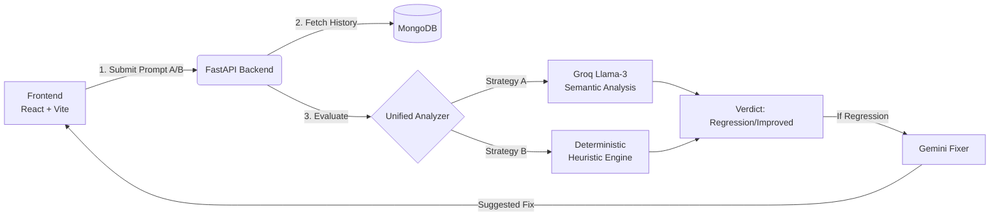

<div align="center">
  
# 📉 **RegressAI**


### *Version Control & Regression Testing for LLM APIs*

> **Stop breaking your prompts. Ship AI features with confidence.**
> **Automated Judging • Hybrid Analysis • Auto-Fixing • CI/CD Ready**

</div>

---

## 🛡️ **The Safety Net for GenAI Engineering**

**RegressAI** is a unified platform that prevents "prompt drift" and regression. It compares your new prompt versions against historical baselines to detect degradation in quality, safety, and structure.

Powered by a **Hybrid Evaluation Engine** (LLM Semantic + Deterministic Logic), it doesn't just find bugs—it suggests how to fix them using **Google Gemini**.

---

## 🚀 **Core Superpowers**

| Feature | The Magic Behind It |
| --- | --- |
| 🧠 **Unified Analyzer** | Uses **Groq (Llama-3-70b)** with forced JSON mode to guarantee valid, structured verdicts |
| 🕵️ **Root Cause Detection** | Classifies regressions into specific categories: `SAFETY`, `HALLUCINATION`, `STRUCTURE`, or `CONFIDENCE` |
| 🛡️ **Deterministic Fallback** | If the LLM Judge fails, a heuristic engine takes over to analyze structure, tone, and safety flags |
| 🔧 **Auto-Fixer Agent** | A "Layer-3" agent (Gemini) proposes architecture-aware prompt improvements based on the detected regression |
| 💸 **Usage & Billing** | Integrated **Razorpay** support for premium tier management |

---

## 🏗️ **Architecture: Hybrid & Robust**




---

## 🔬 **Technical Brilliance**

### **1. The "Indestructible" JSON Judge**

We force Llama-3 to output valid JSON using `response_format={"type": "json_object"}` and sophisticated retry logic with varying temperatures.

```python
# From backend/app/unified_analyzer.py
def _call_groq_json_mode(api_key, prompt, temperature=0.3):
    response = client.chat.completions.create(
        model="llama-3.3-70b-versatile",
        messages=[...],
        response_format={"type": "json_object"}  # 🔥 FORCES JSON OUTPUT
    )
    # Guaranteed dictionary return
    return json.loads(response.choices[0].message.content)

```

### **2. Intelligent Heuristic Fallback**

When semantic analysis is unavailable, the system falls back to strict rule-based logic to ensure safety never drops.

```python
# From backend/app/prompt_fixer.py
def _heuristic_fallback(issues, ...):
    if "HALLUCINATION" in root_causes:
        suggestions.append({
            "scope": "rag",
            "change_type": "grounding",
            "suggested_text": "Introduce retrieval grounding..."
        })
    # Returns a valid schema even without LLM
    return structured_response

```

---

## ⚙️ **Setup in 3 Minutes**

### **Prerequisites**

* Python 3.10+
* Node.js 18+
* MongoDB (Local or Atlas)
* API Keys: `GROQ_API_KEY`, `GEMINI_API_KEY`

### **Step 1: Backend (FastAPI)**

```bash
cd backend
pip install -r requirements.txt
# Start the API server
uvicorn app.main:app --reload --port 8000

```

### **Step 2: Frontend (Vite)**

```bash
cd Frontend
npm install
# Start the UI
npm run dev

```

The app will live at **http://localhost:5173** and communicate with the backend at **http://localhost:8000**.

---

## 📸 **See It in Action**

<div align="center">

### **Unified Analysis Dashboard**

*(Visualize your regression tests, confidence scores, and root causes)*


</div>

---

## 🛠️ **Project Structure**

```
RegressAI/
├── Frontend/                 # React + Vite Application
│   ├── src/components/       # Visualizations, Modals, Panels
│   ├── src/services/         # API & Auth connections
│   └── vite.config.js
│
├── backend/                  # FastAPI Application
│   ├── app/
│   │   ├── analysis/         # Behavioral & Tradeoff engines
│   │   ├── api/              # Routes (Analyze, Razorpay, Mock)
│   │   ├── unified_analyzer.py # 🚀 Core Llama-3 Logic
│   │   ├── prompt_fixer.py   # 🔧 Gemini Repair Logic
│   │   └── main.py           # Entry point
│   └── requirements.txt

```

---

## 🌱 **Contributing**

We welcome pull requests! Please check the `backend/app/schemas.py` for data models before submitting API changes.

```bash
git clone https://github.com/Sparky17561/RegressAI.git
git checkout -b feature/amazing-feature
# ... code ...
git push origin feature/amazing-feature

```

---

## 📄 **License**

[MIT License](https://www.google.com/search?q=LICENSE) — Open source and ready for production.

---

<div align="center">

### **RegressAI**

**Because "it works on my machine" isn't good enough for LLMs.**

</div>
